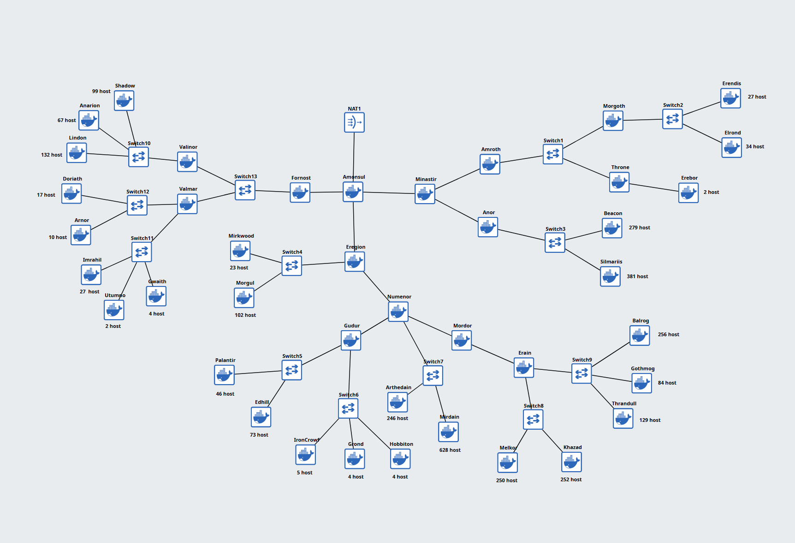
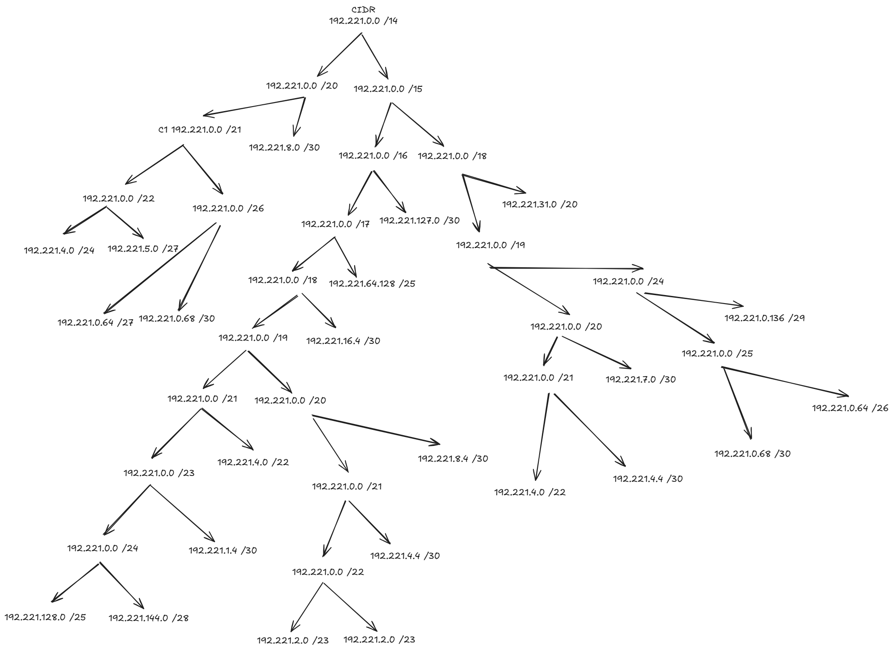
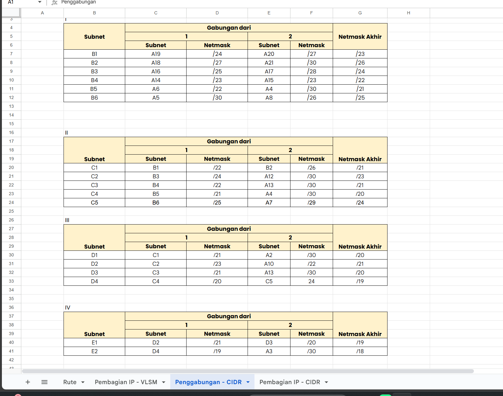
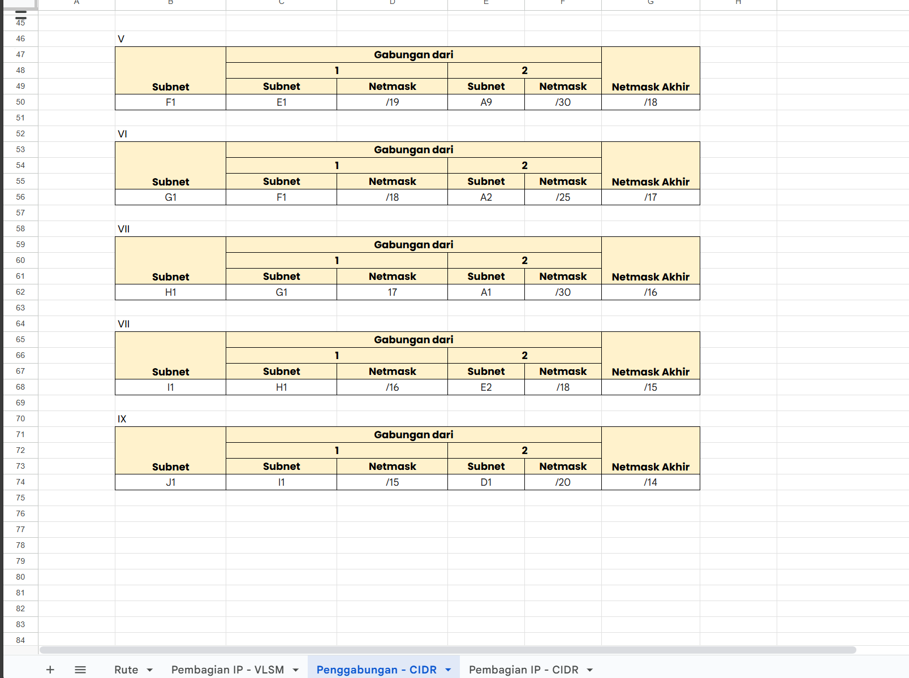
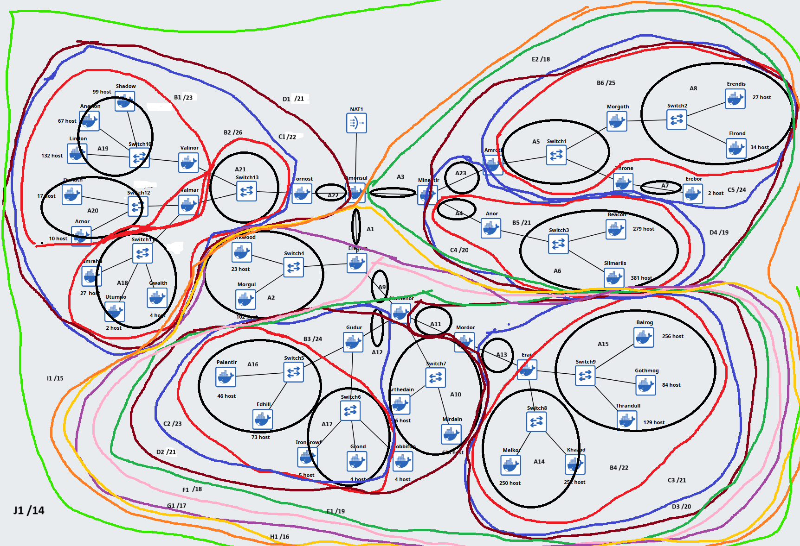

# Jarkom-Modul-4-2025-IT-20

**Laporan Resmi Praktikum Modul 4 — Komunikasi Data & Jaringan Komputer 2025**

## Daftar Anggota

| Nama                  | NRP        |
|-----------------------|------------|
| Zahra Khaalishah      | 5027241070 |
| Dimas Muhammad Putra  | 5027241076 |

# CIDR
## 1. Gambaran Umum Topologi Jaringan

Studi kasus ini mengimplementasikan tata kelola alamat IP untuk jaringan kompleks berdasarkan topologi "Middle Earth Network" dengan total kebutuhan **3094 IP Host**. Implementasi menggunakan dua metode utama untuk efisiensi dan perutean: **VLSM (Variable Length Subnet Masking)** dan **CIDR Aggregation**.

### Topologi Jaringan

Berikut adalah gambaran visual dari seluruh jaringan yang mencakup berbagai *host* dan *router* utama.

---

## 2. Pembagian IP

VLSM digunakan untuk mengalokasikan alamat IP secara efisien, dimulai dari *subnet* dengan kebutuhan IP terbesar hingga terkecil (Link R2R). Total keseluruhan alokasi *host* berada pada *Network ID* **192.221.0.0/20**.

### Tabel VLSM (Alokasi IP Awal)

| Nama Subnet | Rute | Jumlah IP (N+2) | Netmask (/M) | Network ID | Range IP | Keterangan |
| :---: | :--- | :---: | :---: | :---: | :---: | :--- |
| A10 | Numenor + Arthedain | 877 | /22 | 192.221.0.0 | 192.221.0.1 - 192.221.3.254 | Aggregasi Host Terbesar. |
| A6 | Anor + Simarils | 663 | /22 | 192.221.4.0 | 192.221.4.1 - 192.221.7.254 | Aggregasi Host Besar. |
| A14 | Erain + Khazad | 505 | /23 | 192.221.8.0 | 192.221.8.1 - 192.221.9.254 | Aggregasi Host. |
| A15 | Erain + Gothmog | 472 | /23 | 192.221.10.0 | 192.221.10.1 - 192.221.11.254 | Aggregasi Host. |
| A19 | Valmar + Lindon | 134 | /24 | 192.221.12.0 | 192.221.12.1 - 192.221.12.254 | Aggregasi Host. **(Koreksi: /24)** |
| A2 | Eregion + Morgul | 128 | /25 | 192.221.13.0 | 192.221.13.1 - 192.221.13.126 | Aggregasi Host. |
| A16 | Gudur + Edhil | 122 | /25 | 192.221.13.128 | 192.221.13.129 - 192.221.13.254 | Aggregasi Host. |
| A8 | Morgoth + Elrond | 61 | /26 | 192.221.14.0 | 192.221.14.1 - 192.221.14.62 | Aggregasi Host. |
| A18 | Valmar + Utumno | 36 | /27 | 192.221.14.64 | 192.221.14.65 - 192.221.14.94 | Aggregasi Host. |
| A20 | Valmar + Arnor | 30 | /27 | 192.221.14.96 | 192.221.14.97 - 192.221.14.126 | Aggregasi Host. |
| A17 | Gudur + Grond | 16 | /28 | 192.221.14.128 | 192.221.14.129 - 192.221.14.142 | Aggregasi Host Kecil. |
| A7 | Throne + Erebor | 5 | /29 | 192.221.14.144 | 192.221.14.145 - 192.221.14.150 | Subnet Link R2R. |
| A1 - A23 | Link R2R | 4 | /30 | (Berlanjut dari 192.221.14.152) | (2 IP Host per Link) | Link Router-to-Router. |

*Note: Tabel di atas menyajikan urutan VLSM logis untuk efisiensi.*

---

## 3. CIDR Aggregation (Supernetting)

CIDR Aggregation dilakukan untuk menggabungkan *subnet* yang berdekatan menjadi *supernet* yang lebih besar, tujuannya untuk **mengurangi ukuran tabel *routing***. Proses ini dilakukan secara bertahap dari penggabungan terkecil hingga terbesar (J1).

### 3.1. Bagan Pohon Agregasi (CIDR Tree)

Berikut adalah bagan pohon yang menunjukkan bagaimana *subnet* dikelompokkan dan diagregasi:

### 3.2. Proses Penggabungan (Tahap I - IX)

Berikut adalah contoh tabel penggabungan hingga Tahap I - IX (lanjutan):

 
 
Hasil akhir dari CIDR Aggregation adalah **J1/14**, menunjukkan bahwa keseluruhan jaringan dapat diwakili oleh satu blok IP besar: **192.221.0.0/14**.

### 3.3. Visualisasi CIDR Aggregation Final

Berikut adalah visualisasi topologi dengan *loop* yang menggambarkan batas-batas *supernet* hasil agregasi CIDR, mulai dari B1 hingga agregasi final J1/14:

---

## 4. Kesimpulan dan Manfaat

Implementasi gabungan VLSM dan CIDR Aggregation ini menghasilkan tata kelola IP yang:

1.  **Efisiensi IP Tinggi (VLSM):** Setiap *subnet* dialokasikan *Netmask* yang sesuai dengan kebutuhan *host* aktual (N+2), meminimalkan pemborosan alamat IP.
2.  **Skalabilitas & Perutean Efisien (CIDR Aggregation):** Dengan menggunakan CIDR, *router* eksternal ke jaringan utama hanya perlu menyimpan satu entri rute (**192.221.0.0/14**) untuk mencapai seluruh *subnet* internal, yang secara signifikan mengurangi ukuran tabel *routing* (Route Summarization).

---

# VLSM

## 1. Topologi
Berikut adalah topologi yang digunakan untuk VLSM CPT

## 2. Tree VLSM
Berikut adalah Tree yang digunakan dalam metode VLSM dengan CPT

## 3. Pembagian IP

| Subnet                        | Network ID       | Netmask           | Broadcast | Range IP (Usable)        |
|------------------------------|------------------|--------------------|-----------|---------------------------|
| WAN 1 (Amenesul-Minastir)    | 192.221.18.184   | 255.255.255.252    | .187      | 192.221.18.185 - .186     |
| WAN 2 (Amenesul-Fornost)     | 192.221.18.188   | 255.255.255.252    | .191      | 192.221.18.189 - .190     |
| WAN 3 (Amenesul-Eregion)     | 192.221.18.192   | 255.255.255.252    | .195      | 192.221.18.193 - .194     |
| WAN 4 (Minastir-Amroth)      | 192.221.18.196   | 255.255.255.252    | .199      | 192.221.18.197 - .198     |
| WAN 5 (Minastir-Anor)        | 192.221.18.200   | 255.255.255.252    | .203      | 192.221.18.201 - .202     |
| WAN 6 (Fornost-Valinor)      | 192.221.18.204   | 255.255.255.252    | .207      | 192.221.18.205 - .206     |
| WAN 7 (Valinor-Valmar)       | 192.221.18.208   | 255.255.255.252    | .211      | 192.221.18.209 - .210     |
| WAN 8 (Eregion-Numenor)      | 192.221.18.212   | 255.255.255.252    | .215      | 192.221.18.213 - .214     |
| WAN 9 (Numenor-Gudur)        | 192.221.18.216   | 255.255.255.252    | .219      | 192.221.18.217 - .218     |
| WAN 10 (Numenor-Mordor)      | 192.221.18.220   | 255.255.255.252    | .223      | 192.221.18.221 - .222     |
| WAN 11 (Mordor-Erain)        | 192.221.18.224   | 255.255.255.252    | .227      | 192.221.18.225 - .226     |

| Subnet      | Network ID            | Netmask           | Broadcast          | Range IP (Usable)                 |
|-------------|------------------------|--------------------|--------------------|-----------------------------------|
| Mirdain     | 192.221.0.0/22         | 255.255.252.0      | 192.221.3.255      | 192.221.0.1 - 192.221.3.254       |
| Silmarils   | 192.221.4.0/23         | 255.255.254.0      | 192.221.5.255      | 192.221.4.1 - 192.221.5.254       |
| Beacon      | 192.221.6.0/23         | 255.255.254.0      | 192.221.7.255      | 192.221.6.1 - 192.221.7.254       |
| Balrog      | 192.221.8.0/23         | 255.255.254.0      | 192.221.9.255      | 192.221.8.1 - 192.221.9.254       |
| Khazad      | 192.221.10.0/24        | 255.255.255.0      | 192.221.10.255     | 192.221.10.1 - 192.221.10.254     |
| Melkor      | 192.221.11.0/24        | 255.255.255.0      | 192.221.11.255     | 192.221.11.1 - 192.221.11.254     |
| Arthedain   | 192.221.12.0/24        | 255.255.255.0      | 192.221.12.255     | 192.221.12.1 - 192.221.12.254     |
| Lindon      | 192.221.13.0/24        | 255.255.255.0      | 192.221.13.255     | 192.221.13.1 - 192.221.13.254     |
| Thranduil   | 192.221.14.0/24        | 255.255.255.0      | 192.221.14.255     | 192.221.14.1 - 192.221.14.254     |
| Morgul      | 192.221.15.0/25        | 255.255.255.128    | 192.221.15.127     | 192.221.15.1 - 192.221.15.126     |
| Shadow      | 192.221.15.128/25      | 255.255.255.128    | 192.221.15.255     | 192.221.15.129 - 192.221.15.254   |
| Gothmog     | 192.221.16.0/25        | 255.255.255.128    | 192.221.16.127     | 192.221.16.1 - 192.221.16.126     |
| Edhil       | 192.221.16.128/25      | 255.255.255.128    | 192.221.16.255     | 192.221.16.129 - 192.221.16.254   |
| Anarion     | 192.221.17.0/25        | 255.255.255.128    | 192.221.17.127     | 192.221.17.1 - 192.221.17.126     |
| Palantir    | 192.221.17.128/26      | 255.255.255.192    | 192.221.17.191     | 192.221.17.129 - 192.221.17.190   |
| Elrond      | 192.221.17.192/26      | 255.255.255.192    | 192.221.17.255     | 192.221.17.193 - 192.221.17.254   |
| Erendis     | 192.221.18.0/27        | 255.255.255.224    | 192.221.18.31      | 192.221.18.1 - 192.221.18.30      |
| Imrahil     | 192.221.18.32/27       | 255.255.255.224    | 192.221.18.63      | 192.221.18.33 - 192.221.18.62     |
| Mirkwood    | 192.221.18.64/27       | 255.255.255.224    | 192.221.18.95      | 192.221.18.65 - 192.221.18.94     |
| Doriath     | 192.221.18.96/27       | 255.255.255.224    | 192.221.18.127     | 192.221.18.97 - 192.221.18.126    |
| Anor        | 192.221.18.128/28      | 255.255.255.240    | 192.221.18.143     | 192.221.18.129 - 192.221.18.142   |
| IronCrown   | 192.221.18.144/29      | 255.255.255.248    | 192.221.18.151     | 192.221.18.145 - 192.221.18.150   |
| Gwaith      | 192.221.18.152/29      | 255.255.255.248    | 192.221.18.159     | 192.221.18.153 - 192.221.18.158   |
| Grond       | 192.221.18.160/29      | 255.255.255.248    | 192.221.18.167     | 192.221.18.161 - 192.221.18.166   |
| Hobbiton    | 192.221.18.168/29      | 255.255.255.248    | 192.221.18.175     | 192.221.18.169 - 192.221.18.174   |
| Erebor      | 192.221.18.176/30      | 255.255.255.252    | 192.221.18.179     | 192.221.18.177 - 192.221.18.178   |
| Utumno      | 192.221.18.180/30      | 255.255.255.252    | 192.221.18.183     | 192.221.18.181 - 192.221.18.182   |

